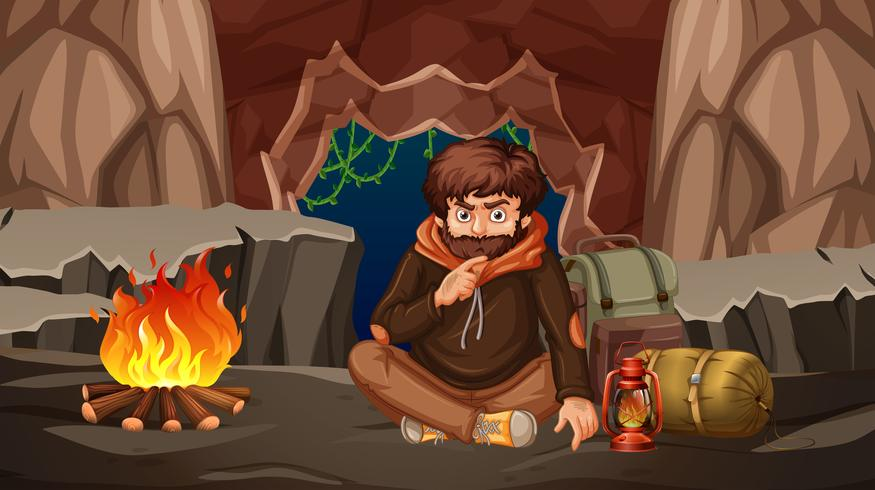

# 🔥 Deep Learning Cave: A Stone Age Retreat

> *"You don't need to understand how it works, just use the API."*  
> — **Horrible advice** we once believed

---

## 🗿 The Origin Story

<div align="center">
  
</div>

### *A Tale of Modern Cavemen*

**It all started with horrible advice.**

*"Just use the API,"* they said. *"Why build from scratch?"* they asked. *"It's already solved!"* they proclaimed. *"You don't need to understand neural networks to use them!"* they confidently assured us.

And we believed them.

For months, we happily typed:
```python
model = API.get_magic_ai("gpt-9000-ultra-mega")
result = model.generate("solve world hunger")
```

**Life was good.** Until it wasn't.

When the model failed, we stared at error messages like ancient hieroglyphics. When it hallucinated, we shrugged and tweaked the prompt 47 times. When asked *"But how does attention work?"* in a meeting, we froze like a deer in headlights and mumbled something about "tokens" and "weights" before excusing ourselves to the bathroom.

**We had become API archaeologists** — digging through documentation, praying to the gods of Stack Overflow, and offering sacrifices to the error log deities.

One fateful day, during our 3 AM debugging session (fueled by questionable coffee ☕ and existential dread), we had an epiphany:

> *"What if... we actually learned how this thing works?"*

Revolutionary, we know.

And thus began our journey **back to the cave**. Not to rediscover fire, but to rediscover how deep learning actually works. Chiseling neural networks onto stone tablets. Building Transformers with our bare hands. Creating CNNs from raw PyTorch ore.

Like our ancestors who didn't just *use* fire but learned to *create* it, we decided to retreat to fundamentals. No black boxes. No magic. No more horrible advice. Just pure mathematics, code, and the stubborn determination to understand every neuron, every gradient, every backprop.

**This repository is that retreat.** A stone age sanctuary where we build everything from scratch. Where "state-of-the-art" means understanding the art, not just using it. Where cave paintings become architecture diagrams, and stone tools become tensor operations.

*Are we reinventing the wheel?* **Yes.** But we're learning why wheels are round, why square wheels fail, and how to craft better wheels for tomorrow.

*Could we just use frameworks?* **Absolutely.** But then we'd still be taking horrible advice—being users instead of creators, consumers instead of craftsmen.

So grab your chisel 🔨 (the PyTorch kind), light your torch 🔥, and join us in this ancient-modern cave. Let's carve deep learning into stone, one implementation at a time.

**Welcome to the retreat. Welcome to the cave.** 🏔️

---

## 🌟 About This Repository

Welcome to a hands-on journey through the world of **Transformer architectures**! This repository is your complete guide to understanding modern AI models — from foundational PyTorch concepts to state-of-the-art architectures like **LLaMA**.

---

## 🌟 About This Repository

Welcome to **Deep Learning Cave** — your stone age retreat for mastering AI from first principles!

This isn't just another tutorial repository. It's a **sanctuary for learning** where we abandon modern conveniences and build everything from scratch. From basic neural networks to cutting-edge Transformers, from simple perceptrons to LLaMA architectures.

**No fluff. No hand-waving. Just pure implementation.**

Every line of code is explained. Every architecture decision is justified. Every notebook is executable. Every concept is built from raw materials.

---

## 🎯 What You'll Learn

By retreating to this cave, you'll master:

✅ **PyTorch fundamentals** — The bedrock of modern deep learning  
✅ **Neural network primitives** — From perceptrons to deep architectures  
✅ **Computer vision** — CNNs, ResNets, Vision Transformers *(coming soon)*  
✅ **Natural language processing** — RNNs, Transformers, LLaMA  
✅ **Modern architectures** — Attention mechanisms, normalization techniques  
✅ **Training strategies** — Optimizers, schedulers, regularization  
✅ **Production patterns** — From research code to deployable models  

**Target Audience:** Stone age learners who refuse horrible advice. Anyone who wants to truly understand AI, not just use it.

---

## 🗺️ Learning Expeditions

This cave has many chambers, each teaching a different aspect of deep learning:

### 🔥 Chamber 1: The Fundamentals *(Current - Complete)*

#### **PyTorch Essentials** → `pytorch_functions_overview.ipynb`
*Master the 20 core PyTorch concepts essential for deep learning*

- **Sections 1-8:** Foundation (tensors, embeddings, attention mechanics)
- **Sections 9-16:** Architecture (residuals, FFN, training loops)
- **Sections 17-20:** Advanced (einsum, inference optimization)

**Each section includes:**
- 🎯 What it does → 🔧 Why it matters → 💻 Code → 💡 Key insight

#### **Deep Neural Networks** → *Included in pytorch_functions_overview.ipynb*
*Complete DNN training example with modern techniques*

- Multi-layer perceptrons
- Batch normalization & dropout
- Adam optimizer & training loops
- Train/validation splits

### 🏛️ Chamber 2: Classical Architectures *(Coming Soon)*

#### **Convolutional Networks** → `cnn_from_scratch.ipynb`
*Visual pattern recognition*

- Convolution operations
- Pooling layers
- ResNet architecture
- Image classification

#### **Recurrent Networks** → `rnn_from_scratch.ipynb`
*Sequential data processing*

- Vanilla RNNs
- LSTMs & GRUs
- Sequence-to-sequence models
- Text generation

### 🦙 Chamber 3: Transformer Architectures *(Current - Complete)*

#### **Vanilla Transformer** → `transformer_from_scratch.ipynb`
*The "Attention Is All You Need" revolution*

- ✅ Complete encoder-decoder implementation
- ✅ Multi-head attention from scratch
- ✅ Sinusoidal positional encoding
- ✅ Position-wise feed-forward networks
- ✅ Layer normalization and residual connections

**Key Learning:** Understanding the foundational architecture that started it all.

#### **Modern LLaMA** → `llama_from_scratch.ipynb` & `llama_complete.ipynb`
*State-of-the-art language models*

- ✅ **RoPE** (Rotary Position Embeddings) — Better position encoding
- ✅ **RMSNorm** — More efficient normalization than LayerNorm
- ✅ **Grouped Query Attention (GQA)** — Memory-efficient attention
- ✅ **SwiGLU** — Advanced activation function
- ✅ **Character-level tokenization** — Simple but effective
- ✅ **Complete training pipeline** — From data to generation

**Key Learning:** How modern LLMs differ from the original Transformer and why.

#### **Vision Transformers** → `vit_from_scratch.ipynb` *(Coming Soon)*
*Transformers for computer vision*

- Patch embeddings
- Self-attention for images
- Hybrid CNN-Transformer models

### 🎓 Chamber 4: Advanced Techniques *(Planned)*

#### **Optimization Strategies**
- Adam, AdamW, Lion optimizers
- Learning rate schedules
- Gradient accumulation
- Mixed precision training

#### **Regularization Methods**
- Dropout variations
- Data augmentation
- Label smoothing
- Weight decay

#### **Model Compression**
- Quantization (8-bit, 4-bit)
- Pruning techniques
- Knowledge distillation
- LoRA fine-tuning

### 🔬 Chamber 5: Research Frontiers *(Future)*

#### **Efficient Architectures**
- Flash Attention
- Linear attention variants
- State Space Models (Mamba)
- Mixture of Experts

#### **Multi-Modal Learning**
- CLIP architecture
- Text-to-image models
- Cross-modal attention

---

## 📂 Cave Layout (Repository Structure)

```
deep-learning-cave/
│
├── pytorch_functions_overview.ipynb    # 20 essential PyTorch concepts + DNN example
├── transformer_from_scratch.ipynb      # Vanilla Transformer (2017)
├── llama_from_scratch.ipynb            # Modern LLaMA implementation
├── llama_complete.ipynb                # Complete LLaMA training pipeline
│
├── llama_checkpoint.pt                 # Trained model checkpoint
│
└── .github/
    └── copilot-instructions.md         # Cave coding guidelines
```

---

## 🚀 Starting Your Retreat

### Prerequisites

```bash
# Python 3.8+
# PyTorch 2.0+ (your stone age tools)
pip install torch torchvision torchaudio
```

### Enter the Cave

1. **Clone the repository:**
```bash
git clone https://github.com/yourusername/deep-learning-cave.git
cd deep-learning-cave
```

2. **Start at the cave entrance (fundamentals):**
   - Open `pytorch_functions_overview.ipynb`
   - Learn the ancient art of tensors and neural networks

3. **Explore deeper chambers:**
   - Build your first Transformer: `transformer_from_scratch.ipynb`
   - Master modern architectures: `llama_from_scratch.ipynb`
   - Train your own models: `llama_complete.ipynb`

4. **Carve your own path:**
   - Modify examples to test understanding
   - Break things and fix them
   - Compare classical vs modern approaches

---

## 💡 Cave Philosophy

### ✨ Stone Age Principles
- **Build everything from scratch** — No external AI libraries (except PyTorch)
- **Understand every line** — No magic, no "just trust me"
- **Progressive mastery** — Start simple, earn complexity
- **Executable knowledge** — Run and modify every example

### 🎓 Learning by Chiseling
- **Carve, don't copy** — Implement, don't just read
- **Break things** — Modify code, see what happens
- **Ask "why"** — Every design choice has a reason
- **Compare eras** — Classical vs modern approaches

### 🔧 Craftsman Patterns
- **Proper training rituals** — Gradient clipping, checkpointing, validation splits
- **Sacred geometry** — Shape checking, dimension tracking
- **Tool mastery** — Temperature sampling, beam search, optimization
- **Cave paintings** — Visual diagrams, step-by-step traces
---

## 🗿 Stone Tablets (Learning Paths)

### 🟢 Apprentice (Beginner)
*Just arrived at the cave, knows basic Python*

1. `pytorch_functions_overview.ipynb` (sections 1-8)
2. Run and modify the DNN example
3. Build `transformer_from_scratch.ipynb` step-by-step
4. Experiment with small modifications

**Time investment:** 2-3 weeks  
**Milestone:** Successfully train a simple neural network

### 🟡 Craftsman (Intermediate)  
*Comfortable with PyTorch, ready for architectures*

1. Complete `pytorch_functions_overview.ipynb` (all 20 sections)
2. Build `transformer_from_scratch.ipynb` independently
3. Compare vanilla Transformer with `llama_from_scratch.ipynb`
4. Understand modern improvements (RoPE, GQA, SwiGLU)

**Time investment:** 1-2 months  
**Milestone:** Implement Transformer without reference

### 🔴 Master (Advanced)
*Deep understanding, ready to innovate*

1. Master all notebooks in the cave
2. Implement architecture variants (different attention, normalization)
3. Optimize for speed and memory
4. Contribute new tutorials or chambers

**Time investment:** 3-6 months  
**Milestone:** Create a novel architecture variation

---

## 🤝 Join the Tribe (Contributing)

This cave grows with each visitor! Contributions welcome:

- 🐛 **Fix broken stones** — Found a bug? Patch it!
- 📝 **Improve cave paintings** — Better explanations
- 🎓 **Add new chambers** — New architectures or techniques (CNNs, RNNs, etc.)
- 💡 **Share wisdom** — Better teaching methods

**Open an issue to discuss major expeditions.**

---

## 🌟 Support This Retreat

If this cave helped you, please:

- ⭐ **Star this repository** — Help others find the cave
- 🔄 **Share your journey** — Tell your tribe
- 💬 **Provide feedback** — What chamber should we build next?
- 🪨 **Contribute** — Add your own stone tablets

---

## 📫 Find the Cave Elder

I carved this cave to make deep learning accessible. Let's connect!

[](https://www.linkedin.com/in/shivamnegi/)
[](https://github.com/shivamnegi92)

**Open to:**
- 💼 Collaborating on educational AI projects
- 🎤 Speaking about deep learning fundamentals
- 💬 Discussing the stone age approach to learning
- 🏔️ Organizing learning retreats

---

## 📚 Ancient Scrolls (References)

### Sacred Texts (Papers)
- [Attention Is All You Need](https://arxiv.org/abs/1706.03762) — Transformer origin (Vaswani et al., 2017)
- [LLaMA: Open and Efficient Foundation Language Models](https://arxiv.org/abs/2302.13971) — Meta AI, 2023
- [Deep Residual Learning for Image Recognition](https://arxiv.org/abs/1512.03385) — ResNet (He et al., 2015)
- [ImageNet Classification with Deep CNNs](https://papers.nips.cc/paper/2012/hash/c399862d3b9d6b76c8436e924a68c45b-Abstract.html) — AlexNet (Krizhevsky et al., 2012)
- [RoFormer: Enhanced Transformer with Rotary Position Embedding](https://arxiv.org/abs/2104.09864) — RoPE, 2021

### Fellow Cave Explorers
- [The Illustrated Transformer](http://jalammar.github.io/illustrated-transformer/) by Jay Alammar
- [PyTorch Documentation](https://pytorch.org/docs/) — Your stone age tools manual
- [Deep Learning Book](https://www.deeplearningbook.org/) by Goodfellow, Bengio, Courville
- [Neural Networks and Deep Learning](http://neuralnetworksanddeeplearning.com/) by Michael Nielsen

---

## 📄 Cave Laws (License)

MIT License — Share the knowledge freely, like cave paintings.

---

## 🙏 Gratitude to Fellow Travelers

- **Vaswani et al.** for the Transformer revolution
- **Meta AI** for open-sourcing LLaMA
- **PyTorch team** for the ultimate stone age tools
- **The open-source tribe** for endless learning resources
- **Every learner** who refuses horrible advice

---

## 🎯 Expedition Status

**Current Phase:** ✅ Foundation chambers complete (PyTorch, DNNs, Transformers, LLaMA)  
**Next Expedition:** 🚧 Building CNN and RNN chambers  
**Long-term Vision:** 🌟 Complete stone age retreat covering all deep learning

---

<div align="center">

**Carved with ❤️ by stone age learners, for stone age learners**

*"In the beginner's mind there are many possibilities, in the expert's mind there are few."* — Shunryu Suzuki

🔥🗿🏔️


</div>
